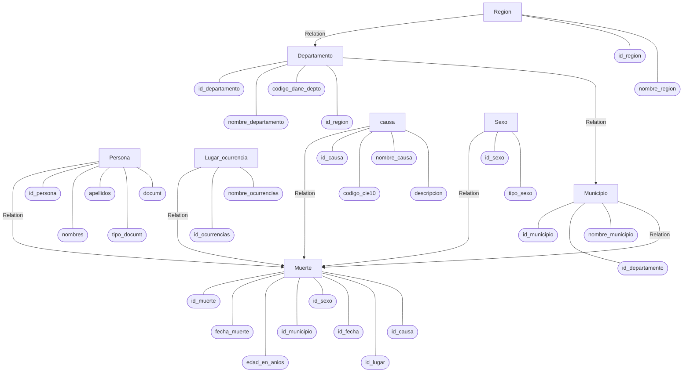

#                             **ACTIVIDAD BASE DE DATOS**


​                                                                                  **JEISON LEONARDO CRISTANCHO GARCÍA**

​                                                                                                                    **J3**

​                                                                                         **PEDRO FELIPE GÓMEZ BONILLA**


​                                                                                                      **CAMPUSLANDS**

​                                                                                                              **APOLO**

​                                                                                          **INTRODUCCION AL BACKEND**

​                                                                                                    **FLORIDABLANCA**

​                                                                                                                 **2025**

 

------


##                                                 **Tabla de Contenidos**


Introducción ............................................................ 3

Caso de Estudio ....................................................... 3

Planificación ........................................................... 3

Construcción del Modelo Conceptual ....................... 3

Construcción del Modelo Lógico .............................. 5

Normalización del Modelo Lógico ......................... 6

Construcción del Modelo Físico ............................. 7

Diagrama E-R ......................................................... 8

Tablas y Relaciones ................................................ 9

Inserción de Datos .................................................. 9

Referencias ............................................................. 10


------


##                                                            **Introducción**


Este informe presenta el diseño completo de una base de datos orientada al registro y análisis de las muertes accidentales en Colombia durante el periodo 2015–2024. El trabajo se estructura en tres modelos de bases de datos; conceptual, lógico y físico, además, el proceso de normalización hasta la tercera forma normal (1FN, 2FN y 3FN). El objetivo es transformar un archivo de tablas de contenido en un sistema relacional claro y mantenible, garantizando integridad, coherencia y facilidad para la generación de consultas analíticas y estadísticas.


##                                                          **Caso de Estudio**

El conjunto de datos de referencia corresponde a registros de muertes accidentales en Colombia, con variables como: año del evento, departamento, causa, sexo y grupo de edad. El conjunto de datos original del DANE está en formato CSV y presenta redundancias y combinaciones de texto en celdas, lo cual dificulta la manipulación eficiente de la información. Por esta razón, se plantea un modelo relacional donde cada entidad y relación quede normalizada, evitando duplicidad y mejorando la consistencia de los datos. 


##                                                            **Planificación**

Las etapas del desarrollo se definieron así: (a) análisis de la base de datos primarios y su estructura, (b) diseño del modelo conceptual para identificar entidades y relaciones, (c) construcción del modelo lógico con definición de claves primarias y foráneas, (d) normalización progresiva hasta la tercera forma normal con ejemplos prácticos aplicados al modelo, y (e) construcción del modelo físico mediante SQL estándar.


##                                        **Construcción del Modelo Conceptual**

El modelo conceptual define las entidades fundamentales y sus relaciones. Cada entidad incluye atributos que representan las características clave de los datos. Este nivel de diseño se centra en el significado y estructura lógica de la información sin especificar implementaciones técnicas.

• REGIÓN (id_region, nombre_region) → Agrupa los departamentos del país.

• DEPARTAMENTO (id_departamento, nombre_departamento, id_region) → Unidad territorial administrativa.

• CAUSA (id_causa, nombre_causa, descripcion_causa) → Motivo de la muerte accidental.

• SEXO (id_sexo, tipo_sexo) → Clasificación biológica o administrativa.

• GRUPO_EDAD (id_grupo_edad, descripcion_grupo_edad, edad_min, edad_max) → Rango etario estandarizado.

• AÑO (id_anio, anio) → Periodo temporal de referencia.

• MUERTE (id_muerte, cantidad, id_causa, id_departamento, id_sexo, id_grupo_edad, id_anio) → Hecho principal del modelo.

Relaciones: REGIÓN 1—N DEPARTAMENTO; DEPARTAMENTO 1—N MUERTE; CAUSA 1—N MUERTE; SEXO 1—N MUERTE; GRUPO_EDAD 1—N MUERTE; AÑO 1—N MUERTE.

La entidad central ,muerte representa los registros agregados de muertes accidentales para una combinación específica de causa, sexo, grupo etario, año y departamento. La jerarquía REGIÓN → DEPARTAMENTO → MUERTE permite realizar análisis espaciales y demográficos, manteniendo independencia entre dimensiones.




##                                  

##                                             **Construcción del Modelo Lógico**

**• REGION**
 (id_region **PK**, nombre_region)

**• DEPARTAMENTO**
 (id_departamento **PK**, nombre_departamento, codigo_dane_depto, id_region **FK→REGIÓN**)

**• MUNICIPIO**
 (id_municipio **PK**, nombre_municipio, codigo_dane_mpio, id_departamento **FK→DEPARTAMENTO**)

**• LOCALIDAD**
 (id_localidad **PK**, nombre_localidad, id_municipio **FK→MUNICIPIO**)

**• FECHA**
 (id_fecha **PK**, anio, mes, dia, rango_hora_x3)

**• SEXO**
 (id_sexo **PK**, tipo_sexo)

**• ESTADO_CIVIL**
 (id_estado_civil **PK**, nombre_estado_civil)

**• ESCOLARIDAD**
 (id_escolaridad **PK**, nombre_escolaridad)

**• PERTENENCIA_ETNICA**
 (id_pertenencia_etnica **PK**, nombre_pertenencia_etnica)

**• ANCESTRO_RACIAL**
 (id_ancestro_racial **PK**, nombre_ancestro_racial)

**• ORIENTACION_SEXUAL**
 (id_orientacion_sexual **PK**, nombre_orientacion_sexual)

**• IDENTIDAD_GENERO**
 (id_identidad_genero **PK**, nombre_identidad_genero)

**• PAIS**
 (id_pais **PK**, nombre_pais)

**• GRUPO_EDAD**
 (id_grupo_edad **PK**, descripcion_grupo_edad, edad_min, edad_max)

**• GRUPO_EDAD_JUDICIAL**
 (id_grupo_judicial **PK**, descripcion_judicial)

**• GRUPO_MAYOR_MENOR**
 (id_grupo_mayor_menor **PK**, etiqueta)

**• CICLO_VITAL**
 (id_ciclo_vital **PK**, descripcion_ciclo)

**• ESCENARIO_HECHO**
 (id_escenario **PK**, nombre_escenario)

**• ZONA_HECHO**
 (id_zona **PK**, nombre_zona)

**• ACTIVIDAD_HECHO**
 (id_actividad **PK**, nombre_actividad)

**• CIRCUNSTANCIA_DETALLADA**
 (id_circunstancia **PK**, descripcion_circunstancia)

**• MANERA_MUERTE**
 (id_manera **PK**, nombre_manera)

**• MECANISMO_CAUSAL**
 (id_mecanismo **PK**, descripcion_mecanismo)

**• DIAGNOSTICO_TOPOGRAFICO**
 (id_diagnostico **PK**, descripcion_topografica)

**• CAUSA**
 (id_causa **PK**, nombre_causa, descripcion_causa)

**• DEFUNCION**
 (id_defuncion **PK**,
 id_fecha **FK→FECHA**,
 id_localidad **FK→LOCALIDAD**,
 id_sexo **FK→SEXO**,
 id_estado_civil **FK→ESTADO_CIVIL**,
 id_escolaridad **FK→ESCOLARIDAD**,
 id_pertenencia_etnica **FK→PERTENENCIA_ETNICA**,
 id_ancestro_racial **FK→ANCESTRO_RACIAL**,
 id_orientacion_sexual **FK→ORIENTACION_SEXUAL**,
 id_identidad_genero **FK→IDENTIDAD_GENERO**,
 id_pais **FK→PAIS**,
 id_grupo_edad **FK→GRUPO_EDAD**,
 id_grupo_judicial **FK→GRUPO_EDAD_JUDICIAL**,
 id_grupo_mayor_menor **FK→GRUPO_MAYOR_MENOR**,
 id_ciclo_vital **FK→CICLO_VITAL**,
 id_escenario **FK→ESCENARIO_HECHO**,
 id_zona **FK→ZONA_HECHO**,
 id_actividad **FK→ACTIVIDAD_HECHO**,
 id_circunstancia **FK→CIRCUNSTANCIA_DETALLADA**,
 id_manera **FK→MANERA_MUERTE**,
 id_mecanismo **FK→MECANISMO_CAUSAL**,
 id_diagnostico **FK→DIAGNOSTICO_TOPOGRAFICO**,
 id_causa **FK→CAUSA**,

```mermaid
classDiagram
direction LR


class Region {
  +int id_region <<PK>>
  +string nombre_region
}

class Departamento {
  +int id_departamento <<PK>>
  +string nombre_departamento
  +string codigo_dane_depto
  +int id_region <<FK>>
}

class Municipio {
  +int id_municipio <<PK>>
  +string nombre_municipio
  +string codigo_dane_mpio
  +int id_departamento <<FK>>
}

class Localidad {
  +int id_localidad <<PK>>
  +string nombre_localidad
  +int id_municipio <<FK>>
}

Region "1" --> "N" Departamento
Departamento "1" --> "N" Municipio
Municipio "1" --> "N" Localidad


class Fecha {
  +int id_fecha <<PK>>
  +int anio
  +string mes
  +int dia
  +string rango_hora_x3
}


class Sexo {
  +int id_sexo <<PK>>
  +string tipo_sexo
}

class EstadoCivil {
  +int id_estado_civil <<PK>>
  +string nombre_estado_civil
}

class Escolaridad {
  +int id_escolaridad <<PK>>
  +string nombre_escolaridad
}

class PertenenciaGrupal {
  +int id_pertenencia_grupal <<PK>>
  +string nombre_pertenencia_grupal
}

class PertenenciaEtnica {
  +int id_pertenencia_etnica <<PK>>
  +string nombre_pertenencia_etnica
}

class AncestroRacial {
  +int id_ancestro_racial <<PK>>
  +string nombre_ancestro_racial
}

class OrientacionSexual {
  +int id_orientacion_sexual <<PK>>
  +string nombre_orientacion_sexual
}

class IdentidadGenero {
  +int id_identidad_genero <<PK>>
  +string nombre_identidad_genero
}

class Transgenero {
  +int id_transgenero <<PK>>
  +string categoria_transgenero
}

class Pais {
  +int id_pais <<PK>>
  +string nombre_pais
}


class GrupoEdadQuinquenal {
  +int id_grupo_quinquenal <<PK>>
  +string etiqueta_quinquenal  
}

class GrupoEdadJudicial {
  +int id_grupo_judicial <<PK>>
  +string etiqueta_judicial     
}

class GrupoMayorMenor {
  +int id_grupo_mayor_menor <<PK>>
  +string etiqueta_mayor_menor  
}

class CicloVital {
  +int id_ciclo_vital <<PK>>
  +string etiqueta_ciclo_vital  
}


class EscenarioHecho {
  +int id_escenario <<PK>>
  +string nombre_escenario      
}

class ZonaHecho {
  +int id_zona <<PK>>
  +string nombre_zona           
}

class ActividadHecho {
  +int id_actividad <<PK>>
  +string nombre_actividad      
}

class CircunstanciaDetallada {
  +int id_circunstancia <<PK>>
  +string nombre_circunstancia  
}

class ManeraMuerte {
  +int id_manera <<PK>>
  +string nombre_manera         
}

class MecanismoCausal {
  +int id_mecanismo <<PK>>
  +string nombre_mecanismo      
}

class DiagnosticoTopografico {
  +int id_diag_topografico <<PK>>
  +string nombre_diag_topografico
}

class Causa {
  +int id_causa <<PK>>
  +string codigo_cie10          
  +string nombre_causa
  +string descripcion_causa
}


class Defuncion {
  +int id_defuncion <<PK>>
  +int cantidad                 
  +int id_fecha <<FK>>
  +int id_municipio <<FK>>
  +int id_localidad <<FK>>      
  +int id_sexo <<FK>>
  +int id_estado_civil <<FK>>
  +int id_escolaridad <<FK>>
  +int id_pertenencia_grupal <<FK>>
  +int id_pertenencia_etnica <<FK>>
  +int id_ancestro_racial <<FK>>
  +int id_orientacion_sexual <<FK>>
  +int id_identidad_genero <<FK>>
  +int id_transgenero <<FK>>
  +int id_pais_nacimiento <<FK>>
  +int id_grupo_quinquenal <<FK>>
  +int id_grupo_judicial <<FK>>
  +int id_grupo_mayor_menor <<FK>>
  +int id_ciclo_vital <<FK>>
  +int id_escenario <<FK>>
  +int id_zona <<FK>>
  +int id_actividad <<FK>>
  +int id_circunstancia <<FK>>
  +int id_manera <<FK>>
  +int id_mecanismo <<FK>>
  +int id_diag_topografico <<FK>>
  +string observaciones
}


Fecha "1" --> "N" Defuncion
Municipio "1" --> "N" Defuncion
Localidad "1" --> "N" Defuncion
Sexo "1" --> "N" Defuncion
EstadoCivil "1" --> "N" Defuncion
Escolaridad "1" --> "N" Defuncion
PertenenciaGrupal "1" --> "N" Defuncion
PertenenciaEtnica "1" --> "N" Defuncion
AncestroRacial "1" --> "N" Defuncion
OrientacionSexual "1" --> "N" Defuncion
IdentidadGenero "1" --> "N" Defuncion
Transgenero "1" --> "N" Defuncion
Pais "1" --> "N" Defuncion
GrupoEdadQuinquenal "1" --> "N" Defuncion
GrupoEdadJudicial "1" --> "N" Defuncion
GrupoMayorMenor "1" --> "N" Defuncion
CicloVital "1" --> "N" Defuncion
EscenarioHecho "1" --> "N" Defuncion
ZonaHecho "1" --> "N" Defuncion
ActividadHecho "1" --> "N" Defuncion
CircunstanciaDetallada "1" --> "N" Defuncion
ManeraMuerte "1" --> "N" Defuncion
MecanismoCausal "1" --> "N" Defuncion
DiagnosticoTopografico "1" --> "N" Defuncion
Causa "1" --> "N" Defuncion

```




###                                                           **Entidades principales y relaciones**

**Hechos - Dimensiones**: `Defuncion` es la tabla de **hechos** (1 registro = 1 fallecimiento; `cantidad=1`). Todo lo demás son **dimensiones** de baja cardinalidad que estabilizan los catálogos y eliminan redundancia.

**Geografía**: la jerarquía **Región→Departamento→Municipio→Localidad** te permite análisis espaciales; los códigos DANE se preservan como atributos.

**Tiempo**: `Fecha` reúne año, mes, día y rango de hora.

**Persona/Demografía**: separo cada clasificación (sexo, estado civil, escolaridad, pertenencia étnica/grupal, ancestro racial, orientación sexual, identidad de género, transgénero, país de nacimiento).

**Edad/Ciclos**: el dataset trae **4 clasificaciones** (quinquenal, judicial, mayor/menor, ciclo vital).

**Hecho/Contexto**: “Escenario”, “Zona”, “Actividad”, “Circunstancia detallada”, “Mecanismo causal”, “Diagnóstico topográfico” y “Manera de muerte” forman el contexto del evento. Aunque “Manera” sea constante (“Accidental”), se conserva por auditabilidad.


##                                         **Normalización del Modelo Lógico**


### **Primera Forma Normal (1FN)**

La Primera Forma Normal (1FN) busca que todos los atributos sean atómicos, es decir, que cada campo contenga un solo valor indivisible. También elimina columnas que contengan listas o valores repetidos dentro de una misma celda. En la base original MUERTES existían combinaciones como 'Caída/Ahogamiento' o '15-19 años / 20-24 años', lo que no cumple con esta regla. Para cumplir la 1FN, se separaron estos datos en tablas individuales como CAUSA, SEXO y GRUPO_EDAD. De esta manera, la tabla MUERTES contiene únicamente claves numéricas (FK) y el valor agregado de 'cantidad'. El resultado es una estructura más limpia y apta para consultas SQL.

### **Segunda Forma Normal (2FN)**

La Segunda Forma Normal (2FN) elimina dependencias parciales, que ocurren cuando un atributo depende solo de una parte de una clave compuesta. En la versión inicial, el campo 'nombre_region' dependía únicamente del 'departamento', y no del resto de la clave compuesta (AÑO, DEPARTAMENTO, CAUSA, SEXO, GRUPO_EDAD). Para resolverlo, se creó la tabla REGIÓN con una relación jerárquica 1:N hacía DEPARTAMENTO. Ahora, los atributos de cada tabla dependen completamente de su clave principal. Este ajuste simplifica las relaciones y mejora la consistencia de la información geográfica.

### **Tercera Forma Normal (3FN)**

La Tercera Forma Normal (3FN) elimina dependencias transitivas, es decir, aquellas en las que un atributo no clave depende de otro atributo no clave. En el modelo inicial, 'nombre_region' podría inferirse a partir de 'nombre_departamento', lo que generaba redundancia. En el nuevo modelo, los datos se separan correctamente: REGIÓN contiene la información regional, DEPARTAMENTO solo depende de su propia PK, y MUERTES mantiene referencias mediante claves foráneas.


### Grafica Normalizada

```mermaid
classDiagram
direction LR


class Region {
  +int id_region <<PK>>
  +string nombre_region
}
class Departamento {
  +int id_departamento <<PK>>
  +string nombre_departamento
  +string codigo_dane_depto
  +int id_region <<FK>>
}
class Municipio {
  +int id_municipio <<PK>>
  +string nombre_municipio
  +string codigo_dane_mpio
  +int id_departamento <<FK>>
}
class Localidad {
  +int id_localidad <<PK>>
  +string nombre_localidad
  +int id_municipio <<FK>>
}
Region "1" --> "N" Departamento
Departamento "1" --> "N" Municipio
Municipio "1" --> "N" Localidad


class Fecha {
  +int id_fecha <<PK>>
  +int anio
  +string mes
  +int dia
  +string rango_hora_x3
}


class Sexo {
  +int id_sexo <<PK>>
  +string tipo_sexo
}
class EstadoCivil {
  +int id_estado_civil <<PK>>
  +string nombre_estado_civil
}
class Escolaridad {
  +int id_escolaridad <<PK>>
  +string nombre_escolaridad
}
class PertenenciaEtnica {
  +int id_pertenencia_etnica <<PK>>
  +string nombre_pertenencia_etnica
}
class AncestroRacial {
  +int id_ancestro_racial <<PK>>
  +string nombre_ancestro_racial
}
class OrientacionSexual {
  +int id_orientacion_sexual <<PK>>
  +string nombre_orientacion_sexual
}
class IdentidadGenero {
  +int id_identidad_genero <<PK>>
  +string nombre_identidad_genero
}
class Pais {
  +int id_pais <<PK>>
  +string nombre_pais
}


class GrupoEdad {
  +int id_grupo_edad <<PK>>
  +string descripcion_grupo_edad
  +int edad_min
  +int edad_max
}
class GrupoEdadJudicial {
  +int id_grupo_judicial <<PK>>
  +string descripcion_judicial
}
class GrupoMayorMenor {
  +int id_grupo_mayor_menor <<PK>>
  +string etiqueta
}
class CicloVital {
  +int id_ciclo_vital <<PK>>
  +string descripcion_ciclo
}


class EscenarioHecho {
  +int id_escenario <<PK>>
  +string nombre_escenario
}
class ZonaHecho {
  +int id_zona <<PK>>
  +string nombre_zona
}
class ActividadHecho {
  +int id_actividad <<PK>>
  +string nombre_actividad
}
class CircunstanciaDetallada {
  +int id_circunstancia <<PK>>
  +string descripcion_circunstancia
}
class ManeraMuerte {
  +int id_manera <<PK>>
  +string nombre_manera
}
class MecanismoCausal {
  +int id_mecanismo <<PK>>
  +string descripcion_mecanismo
}
class DiagnosticoTopografico {
  +int id_diagnostico <<PK>>
  +string descripcion_topografica
}
class Causa {
  +int id_causa <<PK>>
  +string nombre_causa
  +string descripcion_causa
}


class Defuncion {
  +int id_defuncion <<PK>>
  +int id_fecha <<FK>>
  +int id_localidad <<FK>>
  +int id_sexo <<FK>>
  +int id_estado_civil <<FK>>
  +int id_escolaridad <<FK>>
  +int id_pertenencia_etnica <<FK>>
  +int id_ancestro_racial <<FK>>
  +int id_orientacion_sexual <<FK>>
  +int id_identidad_genero <<FK>>
  +int id_pais <<FK>>
  +int id_grupo_edad <<FK>>
  +int id_grupo_judicial <<FK>>
  +int id_grupo_mayor_menor <<FK>>
  +int id_ciclo_vital <<FK>>
  +int id_escenario <<FK>>
  +int id_zona <<FK>>
  +int id_actividad <<FK>>
  +int id_circunstancia <<FK>>
  +int id_manera <<FK>>
  +int id_mecanismo <<FK>>
  +int id_diagnostico <<FK>>
  +int id_causa <<FK>>
}


Fecha "1" --> "N" Defuncion
Localidad "1" --> "N" Defuncion
Sexo "1" --> "N" Defuncion
EstadoCivil "1" --> "N" Defuncion
Escolaridad "1" --> "N" Defuncion
PertenenciaEtnica "1" --> "N" Defuncion
AncestroRacial "1" --> "N" Defuncion
OrientacionSexual "1" --> "N" Defuncion
IdentidadGenero "1" --> "N" Defuncion
Pais "1" --> "N" Defuncion
GrupoEdad "1" --> "N" Defuncion
GrupoEdadJudicial "1" --> "N" Defuncion
GrupoMayorMenor "1" --> "N" Defuncion
CicloVital "1" --> "N" Defuncion
EscenarioHecho "1" --> "N" Defuncion
ZonaHecho "1" --> "N" Defuncion
ActividadHecho "1" --> "N" Defuncion
CircunstanciaDetallada "1" --> "N" Defuncion
ManeraMuerte "1" --> "N" Defuncion
MecanismoCausal "1" --> "N" Defuncion
DiagnosticoTopografico "1" --> "N" Defuncion
Causa "1" --> "N" Defuncion

```




##                                            **Construcción del Modelo Físico**

```sql

-- Muertes Accidentales en Colombia (2015–2024)

CREATE TABLE Region (
    id_region INTEGER GENERATED ALWAYS AS IDENTITY PRIMARY KEY,
    nombre_region VARCHAR(100) NOT NULL
);

CREATE TABLE Departamento (
    id_departamento INTEGER GENERATED ALWAYS AS IDENTITY PRIMARY KEY,
    nombre_departamento VARCHAR(120) NOT NULL,
    codigo_dane_depto VARCHAR(10),
    id_region INTEGER NOT NULL,
    FOREIGN KEY (id_region) REFERENCES Region(id_region)
);

CREATE TABLE Municipio (
    id_municipio INTEGER GENERATED ALWAYS AS IDENTITY PRIMARY KEY,
    nombre_municipio VARCHAR(120) NOT NULL,
    codigo_dane_mpio VARCHAR(10),
    id_departamento INTEGER NOT NULL,
    FOREIGN KEY (id_departamento) REFERENCES Departamento(id_departamento)
);

CREATE TABLE Localidad (
    id_localidad INTEGER GENERATED ALWAYS AS IDENTITY PRIMARY KEY,
    nombre_localidad VARCHAR(120),
    id_municipio INTEGER NOT NULL,
    FOREIGN KEY (id_municipio) REFERENCES Municipio(id_municipio)
);


CREATE TABLE Fecha (
    id_fecha INTEGER GENERATED ALWAYS AS IDENTITY PRIMARY KEY,
    anio INTEGER NOT NULL,
    mes VARCHAR(15),
    dia INTEGER,
    rango_hora_x3 VARCHAR(20)
);


CREATE TABLE Sexo (
    id_sexo INTEGER GENERATED ALWAYS AS IDENTITY PRIMARY KEY,
    tipo_sexo VARCHAR(30) NOT NULL
);

CREATE TABLE EstadoCivil (
    id_estado_civil INTEGER GENERATED ALWAYS AS IDENTITY PRIMARY KEY,
    nombre_estado_civil VARCHAR(50) NOT NULL
);

CREATE TABLE Escolaridad (
    id_escolaridad INTEGER GENERATED ALWAYS AS IDENTITY PRIMARY KEY,
    nombre_escolaridad VARCHAR(60)
);

CREATE TABLE PertenenciaEtnica (
    id_pertenencia_etnica INTEGER GENERATED ALWAYS AS IDENTITY PRIMARY KEY,
    nombre_pertenencia_etnica VARCHAR(80)
);

CREATE TABLE AncestroRacial (
    id_ancestro_racial INTEGER GENERATED ALWAYS AS IDENTITY PRIMARY KEY,
    nombre_ancestro_racial VARCHAR(80)
);

CREATE TABLE OrientacionSexual (
    id_orientacion_sexual INTEGER GENERATED ALWAYS AS IDENTITY PRIMARY KEY,
    nombre_orientacion_sexual VARCHAR(80)
);

CREATE TABLE IdentidadGenero (
    id_identidad_genero INTEGER GENERATED ALWAYS AS IDENTITY PRIMARY KEY,
    nombre_identidad_genero VARCHAR(80)
);

CREATE TABLE Pais (
    id_pais INTEGER GENERATED ALWAYS AS IDENTITY PRIMARY KEY,
    nombre_pais VARCHAR(100)
);


CREATE TABLE GrupoEdad (
    id_grupo_edad INTEGER GENERATED ALWAYS AS IDENTITY PRIMARY KEY,
    descripcion_grupo_edad VARCHAR(50),
    edad_min INTEGER,
    edad_max INTEGER
);

CREATE TABLE GrupoEdadJudicial (
    id_grupo_judicial INTEGER GENERATED ALWAYS AS IDENTITY PRIMARY KEY,
    descripcion_judicial VARCHAR(50)
);

CREATE TABLE GrupoMayorMenor (
    id_grupo_mayor_menor INTEGER GENERATED ALWAYS AS IDENTITY PRIMARY KEY,
    etiqueta VARCHAR(30)
);

CREATE TABLE CicloVital (
    id_ciclo_vital INTEGER GENERATED ALWAYS AS IDENTITY PRIMARY KEY,
    descripcion_ciclo VARCHAR(50)
);


CREATE TABLE EscenarioHecho (
    id_escenario INTEGER GENERATED ALWAYS AS IDENTITY PRIMARY KEY,
    nombre_escenario VARCHAR(100)
);

CREATE TABLE ZonaHecho (
    id_zona INTEGER GENERATED ALWAYS AS IDENTITY PRIMARY KEY,
    nombre_zona VARCHAR(50)
);

CREATE TABLE ActividadHecho (
    id_actividad INTEGER GENERATED ALWAYS AS IDENTITY PRIMARY KEY,
    nombre_actividad VARCHAR(100)
);

CREATE TABLE CircunstanciaDetallada (
    id_circunstancia INTEGER GENERATED ALWAYS AS IDENTITY PRIMARY KEY,
    descripcion_circunstancia VARCHAR(255)
);

CREATE TABLE ManeraMuerte (
    id_manera INTEGER GENERATED ALWAYS AS IDENTITY PRIMARY KEY,
    nombre_manera VARCHAR(50)
);

CREATE TABLE MecanismoCausal (
    id_mecanismo INTEGER GENERATED ALWAYS AS IDENTITY PRIMARY KEY,
    descripcion_mecanismo VARCHAR(255)
);

CREATE TABLE DiagnosticoTopografico (
    id_diagnostico INTEGER GENERATED ALWAYS AS IDENTITY PRIMARY KEY,
    descripcion_topografica VARCHAR(255)
);

CREATE TABLE Causa (
    id_causa INTEGER GENERATED ALWAYS AS IDENTITY PRIMARY KEY,
    nombre_causa VARCHAR(150),
    descripcion_causa VARCHAR(255)
);


CREATE TABLE Defuncion (
    id_defuncion INTEGER GENERATED ALWAYS AS IDENTITY PRIMARY KEY,
    id_fecha INTEGER NOT NULL,
    id_localidad INTEGER NOT NULL,
    id_sexo INTEGER,
    id_estado_civil INTEGER,
    id_escolaridad INTEGER,
    id_pertenencia_etnica INTEGER,
    id_ancestro_racial INTEGER,
    id_orientacion_sexual INTEGER,
    id_identidad_genero INTEGER,
    id_pais INTEGER,
    id_grupo_edad INTEGER,
    id_grupo_judicial INTEGER,
    id_grupo_mayor_menor INTEGER,
    id_ciclo_vital INTEGER,
    id_escenario INTEGER,
    id_zona INTEGER,
    id_actividad INTEGER,
    id_circunstancia INTEGER,
    id_manera INTEGER,
    id_mecanismo INTEGER,
    id_diagnostico INTEGER,
    id_causa INTEGER,
    observaciones VARCHAR(255),

    FOREIGN KEY (id_fecha) REFERENCES Fecha(id_fecha),
    FOREIGN KEY (id_localidad) REFERENCES Localidad(id_localidad),
    FOREIGN KEY (id_sexo) REFERENCES Sexo(id_sexo),
    FOREIGN KEY (id_estado_civil) REFERENCES EstadoCivil(id_estado_civil),
    FOREIGN KEY (id_escolaridad) REFERENCES Escolaridad(id_escolaridad),
    FOREIGN KEY (id_pertenencia_etnica) REFERENCES PertenenciaEtnica(id_pertenencia_etnica),
    FOREIGN KEY (id_ancestro_racial) REFERENCES AncestroRacial(id_ancestro_racial),
    FOREIGN KEY (id_orientacion_sexual) REFERENCES OrientacionSexual(id_orientacion_sexual),
    FOREIGN KEY (id_identidad_genero) REFERENCES IdentidadGenero(id_identidad_genero),
    FOREIGN KEY (id_pais) REFERENCES Pais(id_pais),
    FOREIGN KEY (id_grupo_edad) REFERENCES GrupoEdad(id_grupo_edad),
    FOREIGN KEY (id_grupo_judicial) REFERENCES GrupoEdadJudicial(id_grupo_judicial),
    FOREIGN KEY (id_grupo_mayor_menor) REFERENCES GrupoMayorMenor(id_grupo_mayor_menor),
    FOREIGN KEY (id_ciclo_vital) REFERENCES CicloVital(id_ciclo_vital),
    FOREIGN KEY (id_escenario) REFERENCES EscenarioHecho(id_escenario),
    FOREIGN KEY (id_zona) REFERENCES ZonaHecho(id_zona),
    FOREIGN KEY (id_actividad) REFERENCES ActividadHecho(id_actividad),
    FOREIGN KEY (id_circunstancia) REFERENCES CircunstanciaDetallada(id_circunstancia),
    FOREIGN KEY (id_manera) REFERENCES ManeraMuerte(id_manera),
    FOREIGN KEY (id_mecanismo) REFERENCES MecanismoCausal(id_mecanismo),
    FOREIGN KEY (id_diagnostico) REFERENCES DiagnosticoTopografico(id_diagnostico),
    FOREIGN KEY (id_causa) REFERENCES Causa(id_causa)
);

```

##                                                       


##                                                               **Diagrama E-R**

El diagrama entidad-relación posiciona a la tabla MUERTES como entidad central, conectada con las dimensiones CAUSA, SEXO, GRUPO_EDAD, AÑO y DEPARTAMENTO. La entidad DEPARTAMENTO se enlaza con REGIÓN.


 

##                                                          **Tablas y Relaciones**

Las relaciones entre las tablas se definen mediante claves primarias y foráneas, garantizando la integridad referencial. El diseño propuesto permite analizar los datos desde múltiples perspectivas: por causa, género, edad, ubicación y año, sin redundancia ni pérdida de consistencia.


##                                                         **Inserción de Datos**

INSERT INTO region (nombre_region) VALUES ('Caribe');
INSERT INTO departamento (nombre_departamento, codigo_dane_depto, id_region) VALUES ('Atlántico', '08', 1);
INSERT INTO causa (nombre_causa, descripcion_causa) VALUES ('Caída', 'Caída desde altura o superficie resbalosa');
INSERT INTO sexo (tipo_sexo) VALUES ('Femenino');
INSERT INTO grupo_edad (descripcion_grupo_edad, edad_min, edad_max) 
INSERT INTO anio (anio) VALUES (2015);

INSERT INTO muertes (id_causa, id_departamento, id_sexo, id_grupo_edad, id_anio, cantidad)
VALUES (1);


------


## **Referencias**

DANE – Muertes accidentales en Colombia (2015–2024). Documentación y datos abiertos.
Elmasri & Navathe. Sistemas de Bases de Datos. Pearson.
Documentación SQL Estándar (ANSI/ISO).

